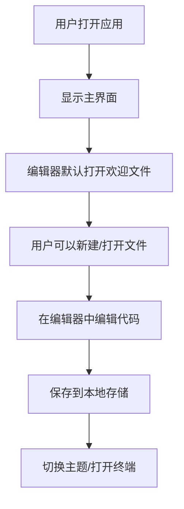
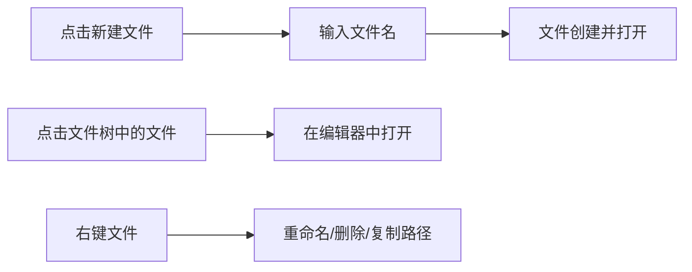

# 云端代码工作室 - 产品需求文档

## 1. 产品概述

一个类似 VS Code 的在线代码编辑器，提供专业的代码编辑体验，支持多标签页、文件管理、终端模拟和主题切换。目标用户是需要在浏览器中进行代码开发的开发者。

- 基于 Monaco Editor 构建的专业级代码编辑能力
- 轻量级、响应迅速，无需安装即可使用
- 支持暗色/亮色主题切换

## 2. 核心功能

### 2.1 用户角色

| 角色 | 使用方式 | 核心权限 |
|------|---------|---------|
| 访客用户 | 直接访问 | 使用基础编辑功能，所有数据存储在浏览器本地 |

### 2.2 功能模块

1. **编辑器核心**: Monaco Editor 代码编辑区域
2. **文件浏览器**: 侧边栏文件树管理
3. **终端模拟器**: 内置命令终端
4. **标签页系统**: 多文件编辑管理
5. **命令面板**: 快捷命令搜索 (Cmd/Ctrl + Shift + P)
6. **主题系统**: 深色/亮色主题切换

### 2.3 页面详情

| 页面 | 模块名称 | 功能描述 |
|------|---------|---------|
| 主界面 | 整体布局 | 顶栏 + 侧边栏 + 编辑区 + 状态栏 |
| 主界面 | 顶栏 | 菜单、标题、主题切换按钮 |
| 主界面 | 侧边栏 | 文件资源管理器、搜索、扩展图标 |
| 主界面 | 编辑区 | Monaco 编辑器 + 标签页 |
| 主界面 | 底部面板 | 终端、问题、输出面板 |
| 主界面 | 状态栏 | 文件类型、行号、编码、语言 |

## 3. 核心流程

### 3.1 主交互流程



### 3.2 文件管理流程



## 4. 用户界面设计

### 4.1 设计风格

**概念方向**: 赛博朋克霓虹风格 - 深邃的暗色背景搭配流动的霓虹光效

- **主色调**: 
  - 背景色: #0d1117 (深邃黑)
  - 霓虹蓝: #58a6ff (主色调)
  - 霓虹紫: #bc8cff (辅助色)
  - 霓虹绿: #3fb950 (成功/活动状态)
  
- **亮色主题**:
  - 背景色: #ffffff
  - 主色调: #0066cc
  - 辅助色: #8b5cf6
  - 边框: #e5e7eb

- **按钮风格**: 圆角按钮 (border-radius: 6px)，hover 时有微光效果
- **字体**: 
  - 代码: JetBrains Mono (等宽字体)
  - UI: Inter / -apple-system (系统字体)
- **图标**: Lucide React 图标库
- **布局**: 三栏式布局 - 侧边栏(250px) + 编辑区(flex) + 面板(200px)

### 4.2 页面设计概览

#### 主界面布局

```
┌────────────────────────────────────────────────────────────┐
│  [菜单图标]  云端代码工作室          [主题切换] [设置]     │ ← 顶栏 (40px)
├─────────┬──────────────────────────────────────────────────┤
│         │  [文件1 ×] [文件2 ×] [未命名 ×]                 │ ← 标签栏 (35px)
│  文件   ├──────────────────────────────────────────────────┤
│  浏览器 │                                                  │
│         │                                                  │
│  250px  │              Monaco 编辑器                      │ ← 编辑区 (flex)
│         │                                                  │
│         ├──────────────────────────────────────────────────┤
│         │  [终端] [问题] [输出]    [−] [□] [×]           │ ← 底部面板 (150px)
├─────────┴──────────────────────────────────────────────────┤
│  main  UTF-8  JavaScript  行 1, 列 1  [扩展图标]         │ ← 状态栏 (24px)
└────────────────────────────────────────────────────────────┘
```

#### 组件样式

| 组件 | 样式 | 布局 | 颜色 | 字体 | 动画 |
|------|------|------|------|------|------|
| 顶栏 | 固定顶部 | flex 居中 | 背景 #161b22 | 14px Inter | 无 |
| 侧边栏 | 可折叠 | 垂直列表 | 背景 #0d1117 | 13px Inter | 展开/收起 200ms |
| 标签栏 | 固定顶部 | flex 横向 | 背景 #161b22 | 13px Inter | hover 背景色 150ms |
| 编辑器 | 全高 | Monaco | Monaco 主题 | 14px JetBrains Mono | 无 |
| 终端 | 可调整高度 | 垂直滚动 | 背景 #0d1117 | 13px JetBrains Mono | 输入闪烁 |
| 状态栏 | 固定底部 | flex 居中 | 背景 #007acc | 12px Inter | 无 |

### 4.3 响应式设计

- **桌面端 (≥1024px)**: 完整三栏布局
- **平板端 (768px-1023px)**: 侧边栏默认收起，点击图标展开
- **移动端 (<768px)**: 底部 Tab 导航切换视图，不支持并排显示

### 4.4 视觉效果

- **暗色主题背景**: 带微妙的噪点纹理
- **霓虹光效**: 活动标签、选中文件有柔和的 glow 效果
- **终端**: 绿色/蓝色/紫色命令输出，带轻微的扫描线效果

## 5. 技术约束

- 前端单页应用，无需后端
- 所有数据存储在浏览器 LocalStorage
- 使用 Monaco Editor 社区版
- 支持现代浏览器 (Chrome, Firefox, Safari, Edge)
