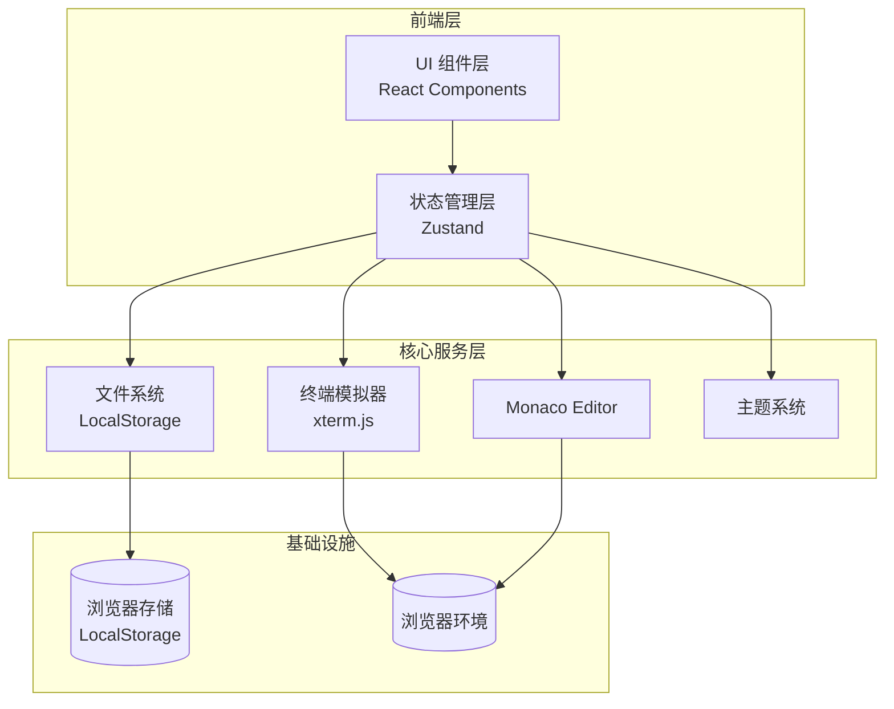

# 云端代码工作室 - 技术架构文档

## 1. 架构设计



## 2. 技术选型

### 2.1 核心技术栈

- **前端框架**: React 18 + TypeScript
- **构建工具**: Vite
- **样式方案**: Tailwind CSS + CSS Variables
- **编辑器**: Monaco Editor (@monaco-editor/react)
- **终端**: xterm.js + xterm-addon-fit
- **状态管理**: Zustand
- **图标**: Lucide React
- **部署**: GitHub Pages

### 2.2 项目结构

```
cloud-code-studio/
├── public/
│   └── favicon.ico
├── src/
│   ├── components/
│   │   ├── Editor/
│   │   │   ├── CodeEditor.tsx       # Monaco 编辑器封装
│   │   │   ├── TabBar.tsx           # 标签栏
│   │   │   └── EditorArea.tsx       # 编辑区容器
│   │   ├── Sidebar/
│   │   │   ├── FileExplorer.tsx     # 文件浏览器
│   │   │   ├── FileTree.tsx         # 文件树
│   │   │   └── Sidebar.tsx          # 侧边栏容器
│   │   ├── Terminal/
│   │   │   └── Terminal.tsx         # 终端组件
│   │   ├── StatusBar/
│   │   │   └── StatusBar.tsx        # 状态栏
│   │   ├── TitleBar/
│   │   │   └── TitleBar.tsx         # 顶栏
│   │   └── CommandPalette/
│   │       └── CommandPalette.tsx  # 命令面板
│   ├── stores/
│   │   ├── editorStore.ts          # 编辑器状态
│   │   ├── fileStore.ts            # 文件系统状态
│   │   ├── terminalStore.ts        # 终端状态
│   │   └── themeStore.ts           # 主题状态
│   ├── hooks/
│   │   ├── useKeyboardShortcuts.ts # 快捷键
│   │   └── useLocalStorage.ts      # 本地存储
│   ├── utils/
│   │   ├── fileSystem.ts           # 文件系统工具
│   │   └── terminalCommands.ts     # 终端命令
│   ├── types/
│   │   └── index.ts                # 类型定义
│   ├── styles/
│   │   └── globals.css             # 全局样式
│   ├── App.tsx                     # 主应用组件
│   └── main.tsx                    # 入口文件
├── index.html
├── package.json
├── tsconfig.json
├── tailwind.config.js
├── vite.config.ts
└── README.md
```

## 3. 路由定义

单页应用，无需路由。所有功能在同一页面内通过组件切换展示。

| 视图 | 组件 | 描述 |
|------|------|------|
| 主界面 | App.tsx | 整体布局容器 |
| 编辑视图 | EditorArea.tsx | 编辑器 + 标签栏 |
| 侧边视图 | Sidebar.tsx | 文件浏览器 |
| 终端视图 | Terminal.tsx | 底部面板 |

## 4. 状态管理

### 4.1 编辑器状态 (editorStore)

```typescript
interface EditorState {
  openFiles: FileTab[];
  activeFileId: string | null;
  openFile: (file: FileTab) => void;
  closeFile: (fileId: string) => void;
  setActiveFile: (fileId: string) => void;
  updateFileContent: (fileId: string, content: string) => void;
}
```

### 4.2 文件系统状态 (fileStore)

```typescript
interface FileNode {
  id: string;
  name: string;
  type: 'file' | 'folder';
  children?: FileNode[];
  content?: string;
  language?: string;
}

interface FileState {
  files: FileNode[];
  expandedFolders: Set<string>;
  createFile: (name: string, parentId?: string) => void;
  deleteFile: (id: string) => void;
  renameFile: (id: string, newName: string) => void;
  updateFileContent: (id: string, content: string) => void;
  toggleFolder: (folderId: string) => void;
}
```

### 4.3 终端状态 (terminalStore)

```typescript
interface TerminalState {
  lines: TerminalLine[];
  currentInput: string;
  history: string[];
  historyIndex: number;
  addLine: (line: TerminalLine) => void;
  setInput: (input: string) => void;
  executeCommand: (command: string) => void;
  clearTerminal: () => void;
}
```

### 4.4 主题状态 (themeStore)

```typescript
type Theme = 'dark' | 'light';

interface ThemeState {
  theme: Theme;
  toggleTheme: () => void;
  setTheme: (theme: Theme) => void;
}
```

## 5. 数据模型

### 5.1 文件节点

```typescript
interface FileNode {
  id: string;              // 唯一标识 (uuid)
  name: string;            // 文件/文件夹名称
  type: 'file' | 'folder'; // 类型
  parentId: string | null;  // 父节点 ID
  content?: string;        // 文件内容
  language?: string;       // 编程语言
  createdAt: number;       // 创建时间戳
  updatedAt: number;       // 更新时间戳
}
```

### 5.2 标签页

```typescript
interface FileTab {
  id: string;              // 文件 ID
  name: string;           // 显示名称
  language: string;       // 语言
  isDirty: boolean;       // 是否有未保存更改
}
```

### 5.3 终端行

```typescript
interface TerminalLine {
  id: string;
  type: 'input' | 'output' | 'error';
  content: string;
  timestamp: number;
}
```

## 6. 持久化策略

所有数据存储在浏览器 LocalStorage：

| 键名 | 数据类型 | 描述 |
|------|---------|------|
| cloud-code-files | JSON | 文件系统树结构 |
| cloud-code-open-tabs | JSON | 打开的标签页 |
| cloud-code-active-tab | string | 当前活动标签页 ID |
| cloud-code-theme | string | 当前主题 |
| cloud-code-terminal-history | JSON | 终端命令历史 |

## 7. 快捷键映射

| 快捷键 | 功能 |
|--------|------|
| Cmd/Ctrl + S | 保存当前文件 |
| Cmd/Ctrl + N | 新建文件 |
| Cmd/Ctrl + W | 关闭当前标签 |
| Cmd/Ctrl + Shift + P | 打开命令面板 |
| Cmd/Ctrl + B | 切换侧边栏 |
| Cmd/Ctrl + J | 切换终端面板 |
| Cmd/Ctrl + ` | 聚焦终端 |
| Cmd/Ctrl + 1-9 | 切换到对应标签页 |
